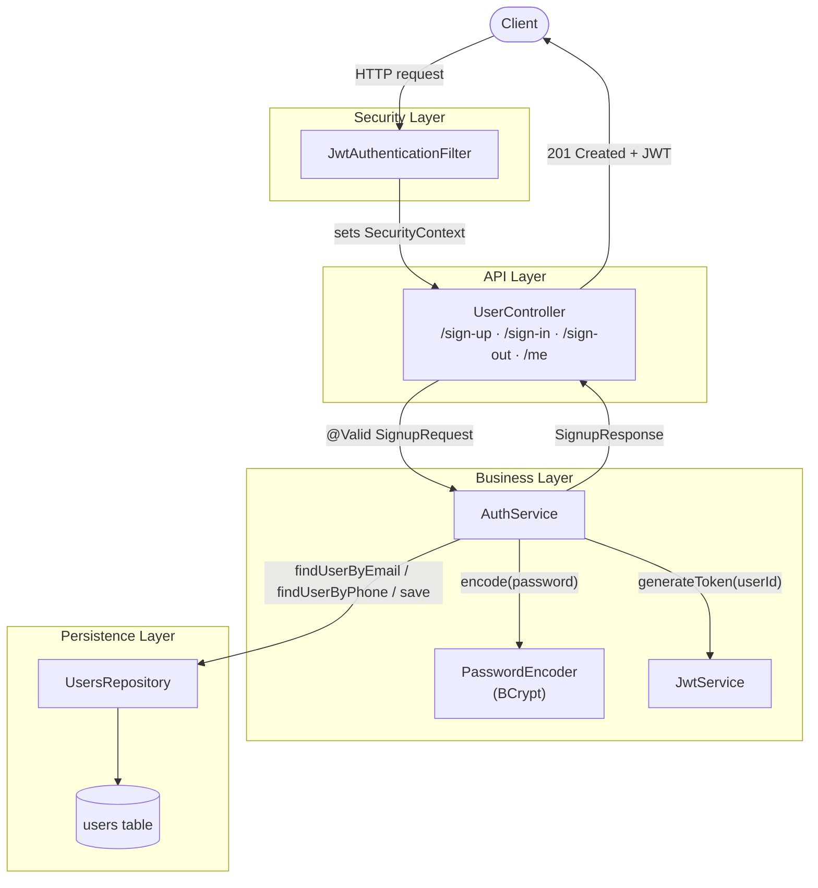

## 🔐 Authentication & Registration

The backend exposes a stateless, JWT-based authentication module built on **Spring Boot**, **Spring Security**, and **Spring Data JDBC**. New users register through a single endpoint that validates the request, enforces email/phone uniqueness, hashes the password with **BCrypt**, persists the account, and immediately returns a signed JWT — so a freshly registered client is authenticated without a separate login call.

### Architecture

### Registration flow

1. `POST /sign-up` is received by `UserController` and bound to a `SignupRequest` DTO.
2. Bean Validation (`@Valid`) checks each field — names, an Egyptian phone number pattern, a valid email, and an 8–128 character password.
3. `AuthService` confirms `password` equals `confirmPassword`, then checks that the email and phone number aren't already registered.
4. The password is hashed with `BCryptPasswordEncoder`; the plaintext value is never persisted.
5. The new `User` (random UUID, role `USER`) is saved through `UsersRepository`.
6. `JwtService` issues a signed JWT (HMAC-SHA, subject = user ID) with a configurable expiry.
7. The client receives `201 Created` with the user ID, email, and JWT.

### Endpoints

| Method | Path        | Auth required | Success | Notes                                  |
|--------|-------------|----------------|---------|-----------------------------------------|
| POST   | `/sign-up`  | No             | `201`   | Creates an account, returns a JWT       |
| POST   | `/sign-in`  | No             | `200`   | Validates credentials, returns a JWT    |
| POST   | `/sign-out` | Yes (Bearer)   | `204`   | Stateless — confirms the caller, no server-side revocation |
| GET    | `/me`       | Yes (Bearer)   | `200`   | Returns the authenticated user's profile|

### Error responses

| Condition                              | Status | Body                                  |
|-----------------------------------------|--------|----------------------------------------|
| Field fails validation                  | `400`  | `{ "message": "<first field error>" }` |
| Password / confirmation mismatch        | `400`  | `{ "message": "Password and confirm password do not match" }` |
| Email already registered                | `400`  | `{ "message": "Email already exists" }` |
| Phone number already registered         | `400`  | `{ "message": "Phone Number already exists" }` |
| Invalid login credentials               | `401`  | `{ "message": "Invalid email or password" }` |

### Security notes

- Sessions are **stateless** (`SessionCreationPolicy.STATELESS`); CSRF is disabled, consistent with a token-only API.
- `JwtAuthenticationFilter` runs before Spring Security's default authentication filter, validating any `Bearer` token and placing the user ID in the security context.
- The security filter chain currently permits all requests (`anyRequest().permitAll()`); endpoints that require authentication (`/me`, `/sign-out`) enforce that check programmatically inside `AuthService`.
- Login failures (unknown email vs. wrong password) return the same generic message and status, so the API never reveals which part of the credential pair was wrong.